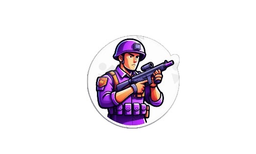
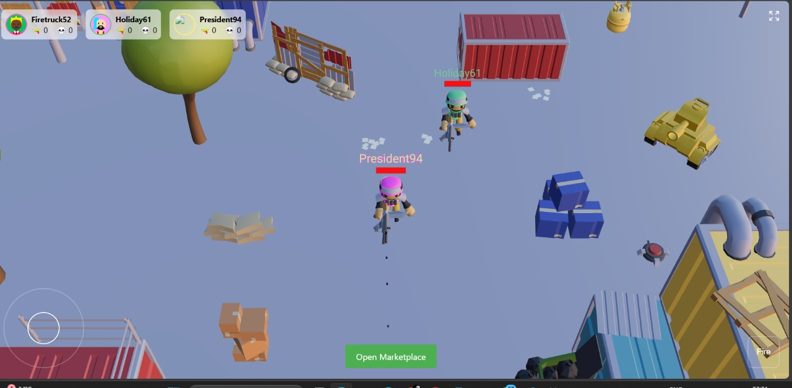
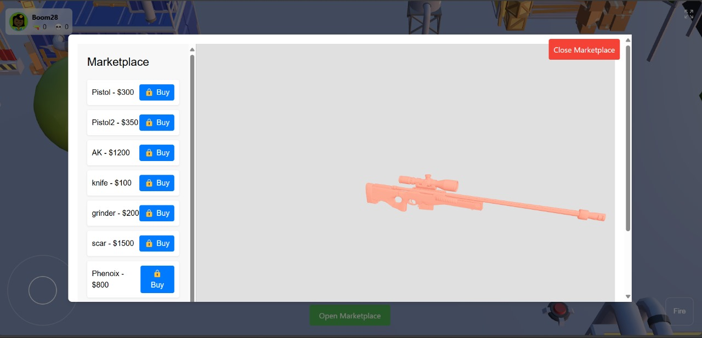
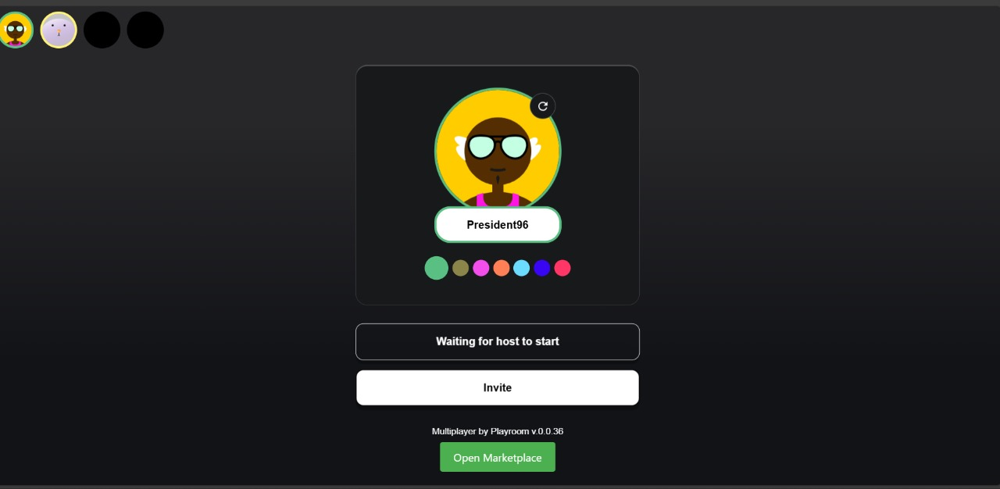
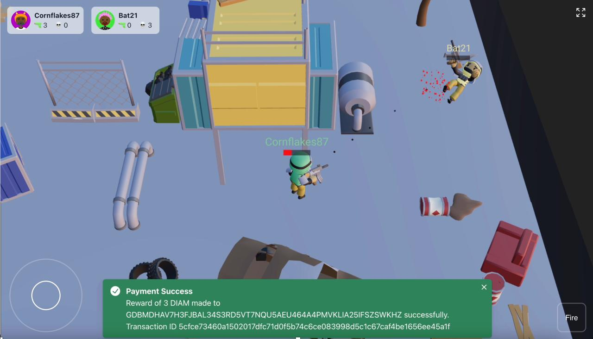

<p align="center">
  
  <h1>Daichain Warfare</h1>
</p>

Daichain Warfare leverages blockchain technology to provide a secure, transparent, and rewarding multiplayer shooter gaming experience. Integrated with the Diamante blockchain, it introduces features like secure asset ownership, provably fair gameplay mechanics via smart contracts, and a Diamante marketplace for purchasing in-game items. Our project aims to redefine player interaction and ownership rights in gaming through innovative blockchain integration.

## Table of Contents

- [Video Tutorial](#video-tutorial)
- [Features](#features)
- [How It Works](#how-it-works)
  - [Gameplay Interface](#gameplay-interface)
  - [Marketplace](#marketplace)
  - [Additional Gameplay Screenshots](#additional-gameplay-screenshots)
- [Local Setup](#local-setup)
- [Project Links](#project-links)
- [Team](#team)
- [Technologies Used](#technologies-used)

## Video Tutorial

## CLICK ON THE PHOTO TO WATCH THE VIDEO
[](https://www.youtube.com/watch?v=EWkw6Vy4bXE)


## Features

- **Multiplayer Action**: Invite friends via QR code or link to play together in real-time.
- **Real-Time Leaderboard**: Track live scores and performance rankings during gameplay.
- **Diamante Marketplace**: Purchase guns via the Diamante blockchain and use them in-game for enhanced gameplay experiences.

## How It Works

### Gameplay Interface


*In this image, players can be seen engaging in a multiplayer shooter game. The leaderboard and player stats are displayed at the top.*

### Marketplace


*Here is the in-game marketplace where players can purchase weapons using the Diamante blockchain.*

### Additional Gameplay Screenshots


*Another shot of players in action, demonstrating the dynamic environment and interactions.*


*Further illustration of the multiplayer experience and interface.*

## Local Setup

To set up Daichain Warfare locally, follow these steps:

1. **Clone the repository:**
    ```sh
    git clone https://github.com/Tanishq1604/DiaMain.git
    cd DiaMain
    ```

2. **Install dependencies:**
    ```sh
    yarn
    ```

3. **Start the blockchain server:**
    ```sh
    cd diamante-blockchain
    yarn
    yarn dev
    ```

4. **Start the development server:**
    ```sh
    cd ..
    yarn dev
    ```

5. **Access the game:**
    Open your web browser and go to `http://localhost:5173`.

## Project Links

- [Tutorial Video](https://www.youtube.com/watch?v=EWkw6Vy4bXE)
- [DevFolio Links](https://devfolio.co/projects/daichain-warfare-a47e)

## Team [ChainChamps]

- **Shivansh Chauhan**
- **Tanishq Maheshwari**

## Technologies Used

- Node.js
- JavaScript
- Three.js
- React.js
- React-Three Fiber
- Diamante Blockchain
